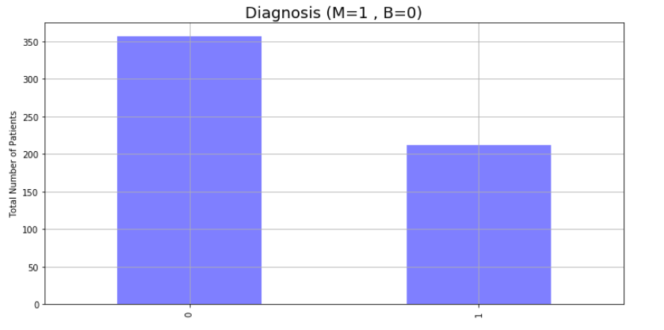
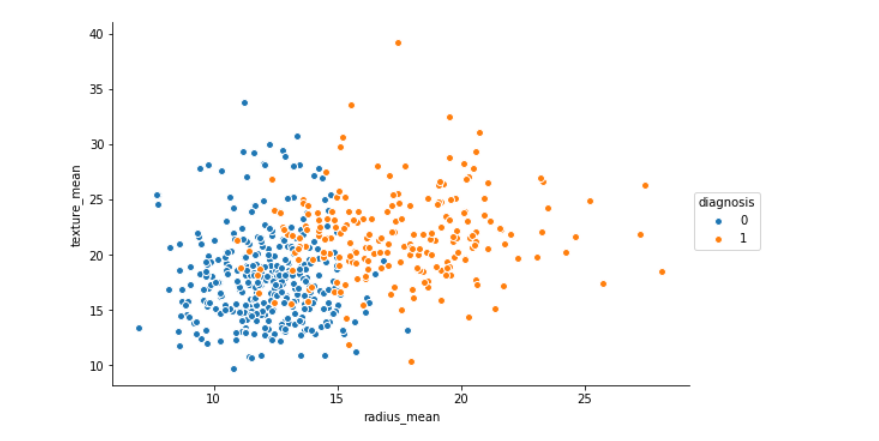
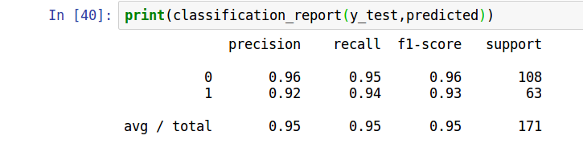
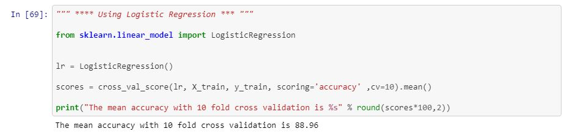
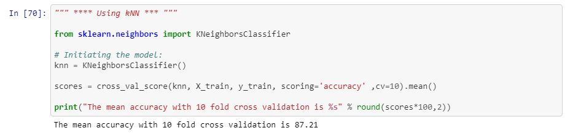

# Breast-Cancer-Prediction

* Breast cancer is now the most common cancer in Indian women, having recently overtaken cervical cancer in this respect.
For every 2 women newly diagnosed with breast cancer, one woman dies of it in India.

* For women diagnosed during 2010-14, five-year survival for breast cancer is now 89.5% in Australia and 90.2% in the USA, but international differences remain very wide, with levels as low as 66.1% in India.

## The dataset given here is about the patients who were detected with 2 kinds of breast cancer : 
* Malignant 
* Benign 

### Pairplot with comparison between _diagnosis_ and _radius_mean_ as well as _texture_mean_

### Classification Report

## Code Requirements

You can install Conda for python which resolves all the dependencies for machine learning.

## Finding Out Accuracy: 

### :zap: Logistic Regression

Logistic Regression measures the relationship between the dependent variable (our label, what we want to predict) and the one or more independent variables (our features), by estimating probabilities using it’s underlying logistic function.

A simple example of a Logistic Regression problem would be an algorithm used for cancer detection that takes screening picture as an input and should tell if a patient has cancer (1) or not (0).

* The mean accuracy with 10 fold cross validation is **88.96**

### :house: kNN (k-Nearest-Neighbor)

K represents the number of training data points lying in proximity to the test data point which we are going to use to find the class. A k-nearest-neighbor is a data classification algorithm that attempts to determine what group a data point is in by looking at the data points around it.

* The mean accuracy with 10 fold cross validation is **87.21**

### :zap: Naive Bayes

Naive Bayes classifiers are a family of simple probabilistic classifiers based on applying Bayes’ theorem with strong (naive) independence assumptions between the features.

* The mean accuracy with 10 fold cross validation is **92.21**

### :evergreen_tree: Random Forest 

Random Forest is a supervised learning algorithm. Like you can already see from it is name, it creates a forest and makes it somehow random. The forest it builds, is an ensemble of Decision Trees, most of the time trained with the “bagging” method. The general idea of the bagging method is that a combination of learning models increases the overall result.

* The accuracyon test data is **94.74**

## Execution : 
To run the file
`BreastCancer.ipynb` ` 
 
